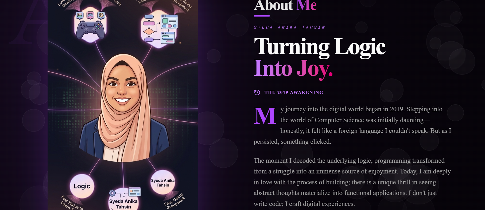

# 🌌 Syeda Anika Tahsin | Personal Portfolio

> A  portfolio website built to showcase my journey, skills, and projects as a Web Developer.

Welcome to the repository of my digital space! This portfolio is crafted with a focus on **immersive user experiences**, **premium aesthetics**, and **fluid animations**, seamlessly blending logic with creativity.



---

## ✨ Key Features

- **🎨 Modern & Premium UI/UX:** A striking design aesthetic featuring a dark ambient theme with vibrant purple and fuchsia accents, utilizing glassmorphism and subtle gradients.
- **✨ Advanced Animations:** Powered by **Framer Motion**, the site features scroll-triggered reveal animations, dynamic text effects, physics-based interactions, and immersive mouse-reactive elements.
- **🌳 Interactive Tech Tree:** A unique, interactive, and beautifully animated visualization of my technical skills and tool stack.
- **🚀 Project Showcase:** A dedicated section displaying my latest works with rich descriptions, external links, and tech stack details.
- **📬 Quantum Contact Form:** A clean and modern contact section for getting in touch seamlessly.
- **📱 Fully Responsive:** Carefully crafted to provide a flawless experience across all devices, from mobile phones to ultra-wide desktop monitors.
- **🌗 Theme Ready:** Configured to support comprehensive light/dark color mappings.

## 🛠️ Technology Stack

This project is built leveraging modern, bleeding-edge web technologies:

**Core Frameworks**
- **[Next.js 16](https://nextjs.org/)** - React framework (App Router)
- **[React 19](https://react.dev/)** - UI library
- **[TypeScript](https://www.typescriptlang.org/)** - Static typing for robust code

**Styling & UI**
- **[Tailwind CSS v4](https://tailwindcss.com/)** - Utility-first CSS framework
- **[shadcn/ui](https://ui.shadcn.com/)** - Lightweight & customizable UI component architecture
- **[Lucide React](https://lucide.dev/)** & **[React Icons](https://react-icons.github.io/react-icons/)** - Iconography

**Animations**
- **[Framer Motion](https://www.framer.com/motion/)** - Production-ready animation library for React

## 📂 Project Structure

```text
protfolio/
├── src/
│   ├── app/
│   │   ├── globals.css         # Core Tailwind directives & styling tokens
│   │   ├── layout.tsx          # Root layout structural bindings
│   │   └── page.tsx            # Main landing page component assembly
│   ├── components/
│   │   ├── ui/                 # Reusable shadcn/ui components
│   │   ├── PortfolioHero.tsx   # Hero section with 3D moon & rotating skills
│   │   ├── InteractiveTechTree.tsx # Comprehensive skills visualization
│   │   ├── Qualification.tsx   # Experience & Education interactive timeline
│   │   ├── Projects.tsx        # Deep dive into developed works
│   │   ├── BigAboutMe.tsx      # Personal journey and personality cards
│   │   ├── QuantumContact.tsx  # Sleek message delivery system
│   │   ├── AnimatedFooter.tsx  # Footer with social redirects
│   │   ├── CustomCursor.tsx    # Branded custom mouse cursor follower
│   │   ├── InteractiveTechTree.tsx # Comprehensive skills visualization
│   └── lib/                    # Utility functions globally available
├── public/                     # Static assets & images
└── package.json                # Project constraints and script maps
```

## 🚀 Getting Started

Follow these steps to run the portfolio locally on your machine:

### Prerequisites

Ensure you have [Node.js](https://nodejs.org/) (v18.x or later) installed on your machine.

### Installation

1. **Clone the repository:**
   ```bash
   git clone https://github.com/Syedatahsin/SyedaAnikaTahsinProtfolio.git
   cd protfolio
   ```

2. **Install dependencies:**
   Using npm:
   ```bash
   npm install
   ```
   *Alternatively, you can use `yarn`, `pnpm`, or `bun`.*

3. **Start the development server:**
   ```bash
   npm run dev
   ```

4. **View in browser:**
   Open [http://localhost:3000](http://localhost:3000) in your selected browser to interact with the portfolio.

## 🤝 Let's Connect

Feel free to reach out to me for collaborations, freelancing, or just to say hi!

- **LinkedIn:** [Syeda Anika Tahsin](https://www.linkedin.com/in/syeda-anika-tahsin)
- **GitHub:** [@Syedatahsin](https://github.com/Syedatahsin/)
- **Instagram:** [@2000__whynot__](https://www.instagram.com/2000__whynot__/)

---

<p align="center">
  <i>Designed & Built with ❤️ by Syeda Anika Tahsin</i>
</p>
